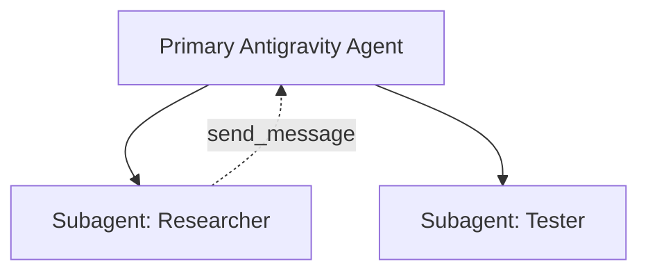

# Antigravity Planning Mode & Rich Artifacts Reference

Antigravity uses a structured planning and verification paradigm paired with interactive UI artifacts.

---

## 1. Planning Mode Workflow

When a request involves architectural decisions, extensive refactoring, or ambiguity:

```
[Research Phase]
       │
       ▼
[Create implementation_plan.md] ──► [Request Feedback (user_facing=true)]
                                              │
                                              ▼
[Verification / Execution]  ◄───  [User Approval]
       │
       ▼
[Create walkthrough.md] ──► [Complete Task]
```

### Artifact Specifications

#### 1. Implementation Plan (`implementation_plan.md`)
- **Location**: `<appDataDir>/brain/<conversationId>/implementation_plan.md`
- **Sections**:
  - `# [Goal Description]`
  - `## User Review Required` (Using GitHub Alerts: `> [!IMPORTANT]`, `> [!WARNING]`)
  - `## Open Questions`
  - `## Proposed Changes` (Categorized with `[NEW]`, `[MODIFY]`, `[DELETE]` and clickable file links)
  - `## Verification Plan` (Automated tests & manual verification steps)

#### 2. Walkthrough Document (`walkthrough.md`)
- **Location**: `<appDataDir>/brain/<conversationId>/walkthrough.md`
- **Purpose**: Summarizes completed changes, test execution logs, and visual validation.

---

## 2. Rich Artifact Formatting Components

Antigravity renders enhanced UI elements within markdown artifacts:

### A. Carousels (`carousel`)
Display sequential slides, UI states, or comparison cards:

````markdown
````carousel

<!-- slide -->

<!-- slide -->
```dart
// Code changes for step 2
```
````
````

### B. Mermaid Diagrams
Visualizing state machines, architecture flows, and sequence interactions:



### C. LaTeX Mathematical Notation
- **Inline**: `\( E = mc^2 \)`
- **Block Display**:
  \[
  \text{Throughput} = \frac{\text{Completed Tasks}}{\text{Duration}}
  \]

### D. Clickable File Links
Always use markdown link syntax with file paths:
- Direct file: `[file_name.dart](file:///absolute/path/file_name.dart)`
- Line range: `[file_name.dart#L10-L25](file:///absolute/path/file_name.dart#L10-L25)`
