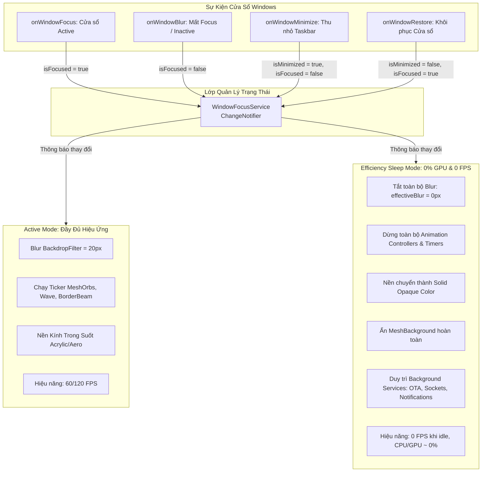

# Kế hoạch Tối ưu Hiệu năng Toàn diện: Chế độ Tiết kiệm Năng lượng khi Cửa sổ Inactive (Flutter Desktop)
# Comprehensive Low-Power Efficiency Sleep Mode Plan for JA_Mini_Showcase

Tài liệu này đặc tả kiến trúc và kế hoạch triển khai chi tiết từng bước (Step-by-Step) nhằm tối ưu hóa hiệu năng, giảm mức tiêu thụ CPU và đưa GPU về mức **0 FPS / ~0% GPU** khi cửa sổ ứng dụng không active (unfocused, nằm dưới cửa sổ khác, hoặc bị thu nhỏ), trong khi vẫn bảo đảm 100% các tác vụ ngầm (thông báo, kết nối, OTA check) hoạt động liên tục.

---

## 1. Phân Tích Thực Trạng & Nguyên Nhân Tiêu Hao Tài Nguyên

### 1.1. Chi phí GPU của hiệu ứng Kính mờ (`BackdropFilter`)
- Trong Flutter Desktop, `BackdropFilter` buộc Flutter GPU Engine (Skia / Impeller) phải thực hiện:
  1. Sao chép bộ đệm hình ảnh (screen buffer) của các lớp phía dưới vào một Render Target phụ ngoài màn hình (Offscreen buffer).
  2. Thực thi Fragment Shader tính toán làm mờ đa hướng (Multi-pass Gaussian Blur) trên GPU.
  3. Tổng hợp (composite) kết quả lại với lớp giao diện phía trên.
- Nếu giao diện vẫn liên tục có hoạt ảnh chuyển động, quy trình này phải lặp lại từ **60 đến 120 lần mỗi giây (60–120 FPS)** ngay cả khi người dùng đang làm việc ở một cửa sổ khác và không hề nhìn vào ứng dụng.

### 1.2. Các Hoạt ảnh Chuyển động Vô tận (Infinite Looping Tickers)
Hiện tại dự án có 5 nguồn chuyển động hoạt động liên tục:
1. **`MeshOrb`** (`lib/widgets/glass_background.dart`): 3 khối cầu ánh sáng trôi đa hướng liên tục (duration 16s–20s) kèm bộ lọc làm mờ tĩnh 85px.
2. **`WaveIndicator`** (`lib/widgets/glass_indicators.dart`): 3 cột sóng âm nhảy liên tục (duration 900ms).
3. **`BorderBeam`** (`lib/widgets/glass_effects.dart`): Viền sáng quét laser liên tục quanh card (duration 5s).
4. **`RotatingGlowBorder`** (`lib/widgets/glass_effects.dart`): Viền phát sáng xoay 360 độ (duration 3s).
5. **`AsymmetricMarqueeText`** (`lib/widgets/glass_marquee.dart`): Timer cuộn chữ trạng thái chạy tuần hoàn.

*Hạn chế của cơ chế cũ*: Các widget này hiện chỉ dùng `AppLifecycleListener` lắng nghe `AppLifecycleState.hidden` và `paused` — trên Windows Desktop, sự kiện này **chỉ phát sinh khi cửa sổ bị Minimize xuống Taskbar**. Khi người dùng chỉ nhấp chuột sang cửa sổ khác (Unfocused / Inactive), Flutter vẫn duy trì trạng thái `resumed` hoặc `inactive` và **các Ticker hoạt ảnh vẫn chạy 100% công suất**.

### 1.3. Hòa trộn DWM Windows (Desktop Window Manager Composition)
- Khi cửa sổ trong suốt (Acrylic / Aero), DWM của Windows phải liên tục hòa trộn độ mờ với hình nền desktop và các cửa sổ bên dưới.

---

## 2. Kiến Trúc Giải Pháp: "Low-Power Efficiency Sleep Mode"

### 2.1. Sơ đồ Luồng Trạng thái & Can thiệp Hệ thống



### 2.2. Bảng So Sánh Chi Tiết Hành Vi Giữa 2 Chế Độ

| Hạng mục | Active Mode (Khi đang sử dụng) | Efficiency Mode (Khi Inactive / Background) |
| :--- | :--- | :--- |
| **Trạng thái Kích hoạt** | Cửa sổ đang được chọn, nằm trên cùng | Người dùng click cửa sổ khác hoặc Minimize |
| **Độ mờ (`cardBlur`, `dialogBlur`)** | 20.0px (hoặc theo cấu hình Glass Tuning) | **0.0px** (Loại bỏ hoàn toàn `BackdropFilter`) |
| **Nền Thẻ Bento / Container** | Kính bán trong suốt (`alpha: 0.25 - 0.45`) | **Màu đặc phẳng (Solid Opaque Color)** |
| **Mesh Orbs Nền** | 3 quả cầu chuyển động mờ 85px | **Ẩn hoàn toàn (`Visibility(visible: false)`)** |
| **Animation Controllers** | `.repeat()` (MeshOrb, Wave, BorderBeam...) | **`.stop()` (Đóng băng tức thì)** |
| **Marquee Text Timers** | Cuộn chữ chu kỳ 1.4s | **Tạm dừng Timer**, chữ đứng yên |
| **Frame Render Rate** | 60 FPS / 120 FPS | **0 FPS** (Không phát sinh frame vẽ mới) |
| **Dịch vụ chạy ngầm (OTA / Net)** | Hoạt động bình thường | **Vẫn hoạt động 100% bình thường** |
| **Mức tiêu thụ CPU/GPU** | 1% – 5% CPU / 5% – 15% GPU | **0% – 0.1% CPU / ~0% GPU** |

---

## 3. Kế Hoạch Triển Khai Step-by-Step (Chi Tiết Từng Bước)

### 📌 Bước 1: Xây dựng Module Quản lý Focus Chuẩn Windows
- **File mới**: `lib/modules/window_focus_service.dart`
- **Mục tiêu**: Lắng nghe trực tiếp sự kiện Native Windows từ `window_manager` (`WindowListener`).
- **Nội dung kỹ thuật**:
  - Triển khai lớp `WindowFocusService extends ChangeNotifier with WindowListener`.
  - Quản lý 2 trạng thái: `_isFocused` (mặc định `true`), `_isMinimized` (mặc định `false`).
  - Lắng nghe:
    - `onWindowFocus()`: Gán `_isFocused = true`, gọi `notifyListeners()`.
    - `onWindowBlur()`: Gán `_isFocused = false`, gọi `notifyListeners()`.
    - `onWindowMinimize()`: Gán `_isMinimized = true; _isFocused = false;`, gọi `notifyListeners()`.
    - `onWindowRestore()`: Gán `_isMinimized = false; _isFocused = true;`, gọi `notifyListeners()`.
  - Cung cấp getter tổng hợp `bool get isEfficiencyMode => !_isFocused || _isMinimized;`.

---

### 📌 Bước 2: Tích hợp vào Dependency Injection của Ứng dụng
- **File sửa đổi**: `lib/main.dart`
- **Mục tiêu**: Cung cấp `WindowFocusService` toàn cục qua `MultiProvider` để mọi widget đều có thể truy cập phản ứng (reactive).
- **Nội dung kỹ thuật**:
  ```dart
  ChangeNotifierProvider(create: (_) => WindowFocusService()..init()),
  ```
  - Khởi tạo lắng nghe `windowManager.addListener` ngay khi app khởi động.

---

### 📌 Bước 3: Nâng cấp `ThemeProvider` Đồng Bộ Hóa Trạng Thái Tiết Kiệm Năng Lượng
- **File sửa đổi**: `lib/theme/theme_provider.dart`
- **Mục tiêu**: Khi ứng dụng ở chế độ Efficiency Mode, các giá trị Blur và Background Color tự động chuyển sang chế độ tiết kiệm tài nguyên mà không làm mất cấu hình gốc của người dùng.
- **Nội dung kỹ thuật**:
  - Bổ sung biến `bool _isWindowFocused = true;`.
  - Thêm phương thức `void updateWindowFocus(bool isFocused)`:
    - Khi `isFocused == false`:
      - `effectiveCardBlur = 0.0`.
      - `effectiveDialogBlur = 0.0`.
      - `effectiveDropdownBlur = 0.0`.
    - Khi `isFocused == true`:
      - Khôi phục lại đúng giá trị `_cardBlur`, `_dialogBlur`, `_dropdownBlur` đã cấu hình.
  - Bổ sung getter `Color get solidCardBg`: Trả về màu nền đặc không trong suốt (Solid Color) để tránh GPU blending khi inactive.

---

### 📌 Bước 4: Nâng Cấp `GlassScaffold` & Nền Cửa Sổ
- **File sửa đổi**: `lib/widgets/glass_scaffold.dart`
- **Mục tiêu**: Loại bỏ triệt để các lớp đồ họa nặng nề phía sau khi không active.
- **Nội dung kỹ thuật**:
  - Đọc `WindowFocusService` từ context.
  - Khi `isEfficiencyMode == true`:
    - Ẩn hoàn toàn `MeshBackground` (không tạo ra 3 widget `MeshOrb` và không chạy shader 85px blur).
    - Ẩn hoặc làm phẳng gradient tint mờ, chuyển sang nền đặc phẳng.
  - Nhờ cơ chế `if (effectiveBlur > 0)` đã có sẵn trong `GlassContainer` và `BentoCard`, khi `effectiveBlur == 0`, widget `BackdropFilter` bị bỏ qua 100%, không tốn bất kỳ chu kỳ GPU nào.

---

### 📌 Bước 5: Đóng Băng Toàn Bộ Hoạt Ảnh (Animation Freezing)
- **Files sửa đổi**:
  1. `lib/widgets/glass_background.dart` (`MeshOrb`)
  2. `lib/widgets/glass_indicators.dart` (`WaveIndicator`)
  3. `lib/widgets/glass_effects.dart` (`BorderBeam`, `RotatingGlowBorder`)
  4. `lib/widgets/glass_marquee.dart` (`AsymmetricMarqueeText`)
- **Mục tiêu**: Dừng tất cả các Ticker và Timer tuần hoàn ngay khi mất focus, khôi phục lại ngay khi focus.
- **Nội dung kỹ thuật**:
  - Tại mỗi widget có `AnimationController`:
    - Lắng nghe `WindowFocusService`.
    - Khi `isEfficiencyMode == true`: Gọi `_controller.stop()`.
    - Khi `isEfficiencyMode == false`: Gọi `_controller.repeat(...)` để chuyển động trở lại.
  - Tại `AsymmetricMarqueeText`:
    - Khi mất focus: Hủy timer hiện tại (`_timer?.cancel()`), giữ chữ ở vị trí tĩnh.
    - Khi có focus lại: Khởi động lại timer cuộn chữ.

---

### 📌 Bước 6: Đảm Bảo & Duy Trì Các Tác Vụ Ngầm (Background Services & Notifications)
- **File kiểm chứng**: `lib/modules/ota_update_service.dart`
- **Mục tiêu**: Đảm bảo việc tắt giao diện không ảnh hưởng đến logic ngầm.
- **Nội dung kỹ thuật**:
  - `OtaUpdateService` chạy bằng Dart `Timer` không đồng bộ trên Event Loop, hoàn toàn độc lập với UI Render Pipeline.
  - Tiến trình kiểm tra cập nhật định kỳ (Hàng ngày, Hàng tuần, Hàng tháng) vẫn chạy bình thường.
  - Khi phát hiện cập nhật mới hoặc sự kiện mạng, ứng dụng vẫn có thể phát thông báo Windows Toast Notification hoặc lưu lại để hiển thị ngay khi người dùng kích hoạt lại ứng dụng.

---

## 4. Các Phương Pháp Tối Ưu Hiệu Năng Nâng Cao Bổ Sung (Gợi Ý Thêm)

Dưới đây là các kỹ thuật chuyên sâu dành riêng cho Flutter Desktop Windows nhằm tối ưu tối đa hiệu năng:

### 4.1. Tối ưu Native DWM qua C++ Runner (`WM_ACTIVATE`)
- **File**: `windows/runner/win32_window.cpp`, `theme_win11.cpp`, `theme_win10.cpp`
- **Cơ chế**: Trong vòng lặp thông điệp Win32 `MessageHandler`:
  - Khi nhận `WM_ACTIVATE` với `LOWORD(wParam) == WA_INACTIVE`: Tạm thời tắt thuộc tính DWM Acrylic / Aero composition, đưa khung cửa sổ về kiểu Standard Opaque.
  - Khi nhận `WA_ACTIVE` hoặc `WA_CLICKACTIVE`: Kích hoạt lại Acrylic/Aero.
  - *Ý nghĩa*: Đây chính là phương pháp mà **Windows Terminal** và **Visual Studio Code** của Microsoft đang sử dụng để giảm tải GPU tuyệt đối khi người dùng đa nhiệm.

### 4.2. Cô lập Render Subtree với `RepaintBoundary`
- Đặt `RepaintBoundary` bao bọc các vùng giao diện cố định:
  - Header Bar (thanh trên cùng).
  - Mobile Dock Nav (thanh điều hướng dưới).
  - Bảng Glass Terminal.
- *Ý nghĩa*: Khi một vùng có nội dung thay đổi, Skia/Impeller chỉ vẽ lại khu vực đó mà không re-rasterize toàn bộ các widget khác trên màn hình.

### 4.3. Giới hạn Bộ nhớ Đệm Hình ảnh (`PaintingBinding ImageCache`)
- Mặc định Flutter Engine phân bổ tới 100MB cho bộ đệm hình ảnh.
- Với ứng dụng desktop quản lý/showcase, ta có thể chủ động tối ưu dung lượng RAM:
  ```dart
  PaintingBinding.instance.imageCache.maximumSizeBytes = 25 * 1024 * 1024; // 25 MB
  PaintingBinding.instance.imageCache.maximumSize = 100; // Tối đa 100 ảnh
  ```

### 4.4. Adaptive Background Network Polling (Giãn cách chu kỳ polling)
- Nếu trong tương lai app có các kết nối WebSocket, Socket ADB, hoặc REST Polling:
  - Khi cửa sổ Active: Polling mỗi 2 giây.
  - Khi cửa sổ Inactive: Tự động chuyển sang chế độ ngủ giãn cách (Exponential Backoff), ví dụ 30 giây hoặc 60 giây một lần để tiết kiệm băng thông và I/O hệ thống.

### 4.5. Windows 11 EcoQoS (Process Power Throttling)
- Sử dụng API Win32 `SetProcessInformation` với cờ `ProcessPowerThrottling` để yêu cầu Windows xếp tiến trình ứng dụng vào nhóm **Efficiency Mode**.
- Hệ điều hành sẽ ưu tiên đẩy ứng dụng sang chạy trên các nhân tiết kiệm điện (E-Cores), nhường nhân xung nhịp cao (P-Cores) cho các tác vụ đồ họa/game khác của người dùng.

---

## 5. Quy Trình Kiểm Thử & Xác Nhận (Verification Checklist)

Tuân thủ nghiêm ngặt **Quy tắc bắt buộc số 4 (Rule 4)** của dự án:

1. **Kiểm thử Tự động (Automated Verification)**:
   - Viết unit test mới cho `WindowFocusService` trong `test/window_focus_service_test.dart` (kiểm tra chuyển đổi trạng thái `isFocused`, `isEfficiencyMode`).
   - Chạy `dart analyze`: Phải đạt **0 issues/warnings**.
   - Chạy `dart format .`: Định dạng toàn bộ code theo chuẩn.
   - Chạy `flutter test`: Toàn bộ **70+ unit & widget tests** phải đạt **PASS 100%**.
2. **Kiểm thử Thực tế trên Windows (Real Hardware Profiling)**:
   - Mở Windows Task Manager (Tab Performance -> GPU & CPU).
   - Khi cửa sổ Active: Kiểm tra hiệu ứng kính mờ và chuyển động hoạt động mượt mà.
   - Click sang cửa sổ khác (Unfocused):
     - Xác nhận hiệu ứng kính mờ tắt ngay lập tức (phẳng, rõ nét, không mờ).
     - Xác nhận các chuyển động dừng lại hoàn toàn.
     - Xác nhận thông số GPU Process rơi về **0% GPU** và **0 FPS**.
   - Click lại vào cửa sổ app: Giao diện khôi phục mượt mà không bị giật lag (zero-flicker).
   - Kiểm tra chức năng OTA Check chạy ngầm vẫn thông báo chính xác khi có version mới.

---

*Tài liệu được khởi tạo và lưu trữ chính thức tại `docs/PERFORMANCE_EFFICIENCY_PLAN.md`.*
